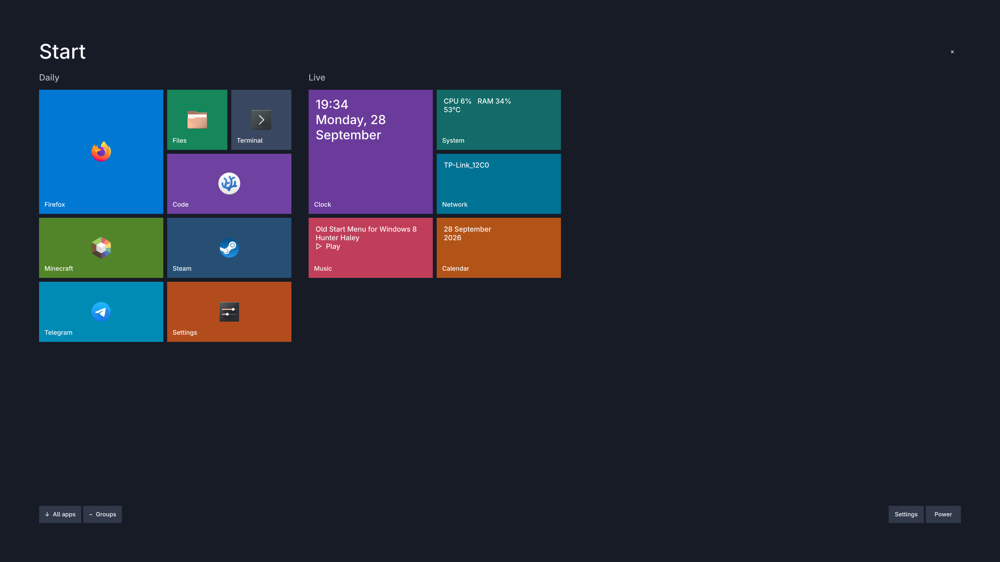
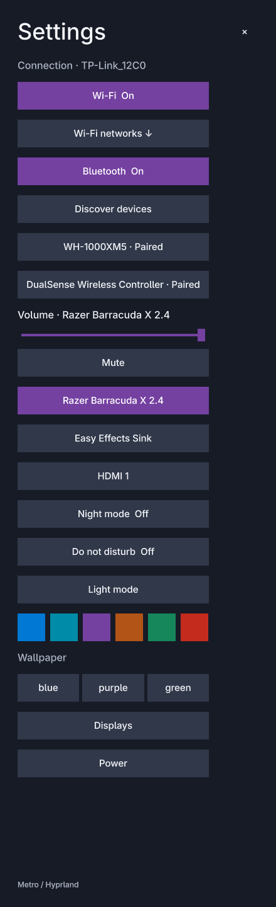
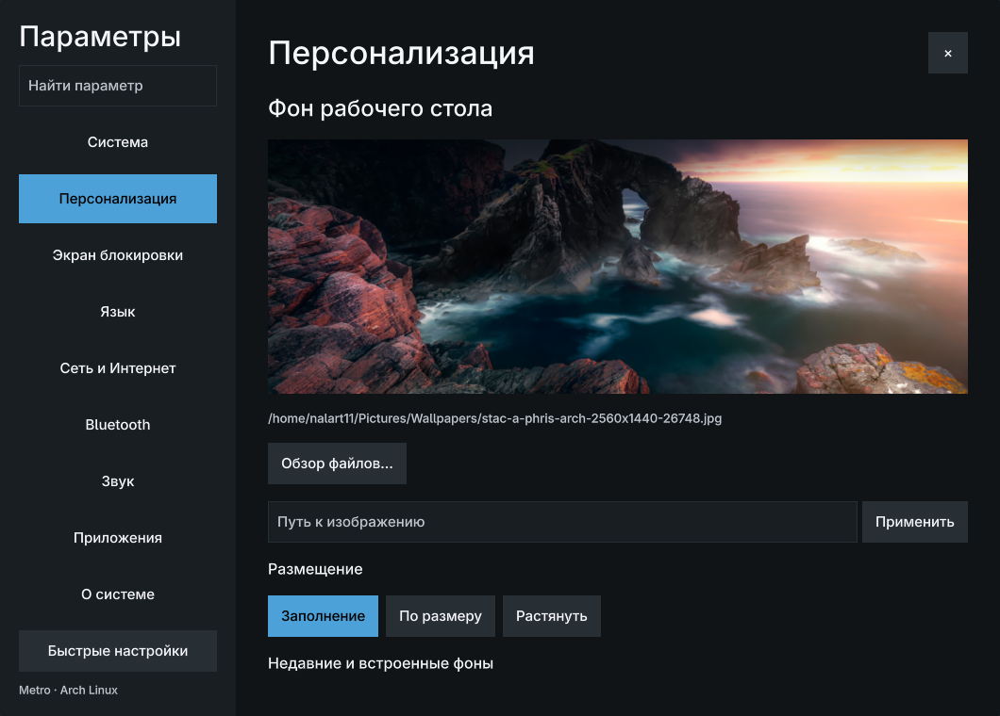
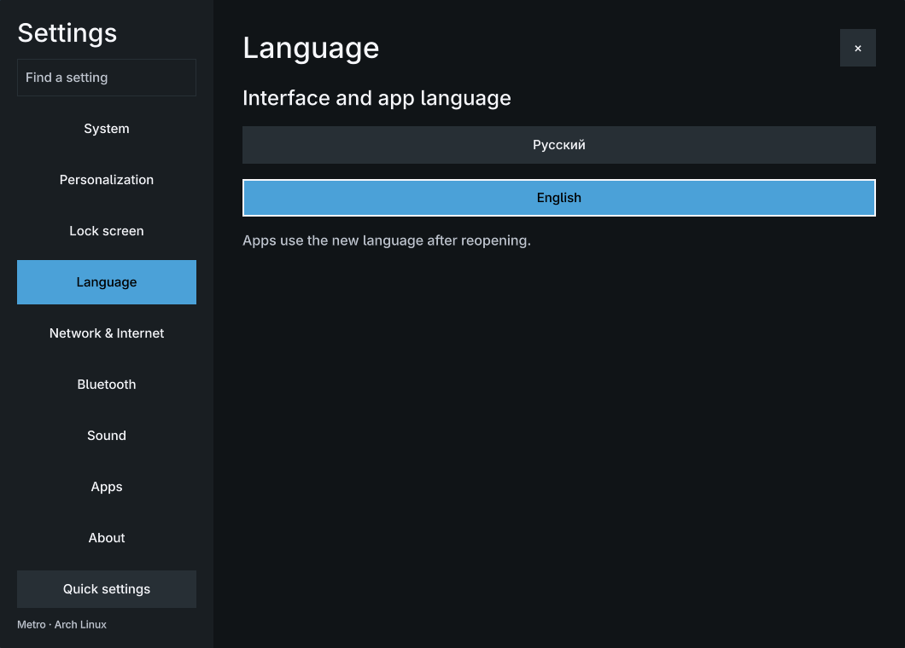

# Hyprland Windows 8 dots

Metro desktop for this Arch Linux / Hyprland 0.55.4 Lua installation. Straight edges, solid colors, full-screen Start, horizontal tile groups and a left-aligned taskbar. Quickshell provides the UI; recovery uses Bash, Python 3 and coreutils without a graphical session.

## Screenshots










Screenshots are from the actual session. Wallpapers and the Linux penguin Start symbol are original procedural SVG designs. Application icons come from installed icon themes.

## Features

Start, movable and resizable 1×1/2×1/1×2/2×2 tiles, live clock/system/network/music/calendar, All Apps, search, running windows, pinned apps, per-monitor workspaces, status notifier tray, Charms, PipeWire volume and output selection, NetworkManager Wi-Fi, BlueZ devices, notifications/history/DND, OSD, hyprlock, power confirmation, a native Polkit authentication dialog, clipboard history and screenshots. Battery and backlight controls appear only when available. Optional weather and external calendars are intentionally absent: no accounts or unreliable scraping are assumed.

Alt+Tab cycles recent windows across workspaces; release Alt or press Enter to focus the selection. Super+Tab cycles workspaces; release Super to switch. Both views show static compositor thumbnails with icon/title fallback. Taskbar windows follow workspace number, then their vertical/horizontal position. Context menus close after 4.5 seconds of inactivity and support unpinning. Semantic zoom changes tile density with the Groups button. Wallpapers fill each monitor separately. Overlays select the focused monitor.

## Dependencies

Already installed: Hyprland, Quickshell (this machine's 0.2.1 fork with `Quickshell.Networking`), Qt Quick Controls, Python, python-pillow, python-gobject, coreutils, kitty, hyprlock, hypridle, PipeWire/WirePlumber, NetworkManager, BlueZ, blueman, hyprsunset, brightnessctl, cliphist, wl-clipboard, grim, slurp, libnotify. Git maintains only this new project. The Code tile launches installed VSCodium. Adwaita Sans is the installed open-source sans-serif font; theme.json can select Inter if installed.

No packages were needed for the initial deployment. The installer checks commands before package installation and uses one explicit `sudo pacman -S --needed` operation at the INSTALL stage if official dependencies are missing. Quickshell, Hyprland and hyprlock must already be installed for pre-install validation; missing validation prerequisites stop PRECHECK with an explicit package command. AUR installation is never implicit. This project targets the installed Lua include topology and refuses unknown main-config structures or managed symlink paths.

## Installation

```bash
cd ~/.local/share/hypr-win8-dots
./install.sh --no-packages --restore-on-error
```

Stages: PRECHECK → BACKUP → VERIFY_BACKUP → GENERATE_CONFIG → VALIDATE_CONFIG → INSTALL → RELOAD → POSTCHECK. Generated configuration is validated in a new directory beneath `~/.cache/hypr-win8-build/`. Before INSTALL, existing dotfiles are untouched. After INSTALL, `--restore-on-error` restores the verified transaction snapshot automatically. Without that flag, an interactive terminal offers recovery and prints the standalone command. Packages, if needed, are outside the dotfile rollback; they are not automatically removed.

The original Hyprland files remain in place. Only the main Lua entrypoint changes its shell autostart and final appearance include; a new `win8` module applies overrides. Original monitors, NVIDIA environment, input, custom rules and window/workspace binds remain included. Applications and the lockscreen launch in independent user scopes so restarting the UI preserves their processes. Services are started by the session autostart hook, without modifying global system services or terminating the current session.

## Dry run

```bash
./install.sh --dry-run
```

Lists backup paths, managed files, missing packages and user services. Creates no files, backups or logs and performs no package/service actions.

## Configuration

`~/.config/hypr-win8/theme.json`, `tiles.json` and `pins.json` are watched live. `config/` is the source for installed UI files; use `update.sh` after editing project code. Personal theme/tiles edits survive updates. Main Lua config is generated from the current entrypoint, preserving later user changes.

Logs: `~/.local/state/hypr-win8/install.log` and `shell.log`. Diagnostics:

```bash
systemctl --user status hypr-win8-shell.service
journalctl --user -u hypr-win8-shell.service -b
quickshell -c win8 ipc call metro status
hyprctl configerrors
```

## Start Screen

Press Super or click the Start button. Start fills the active monitor. Type to search; Escape closes. All apps or a vertical wheel gesture opens the desktop-entry catalog with a short page transition. Horizontal scrolling accommodates narrow/scaled monitors. Groups toggles a compact tile view. Launching closes the overlay. Live music tiles toggle playback when supported.

Start chrome (including the Live heading and footer controls) enters after the tiles and fades out before them. Backgrounds remain flat; opening never scales the screen.

## Window switching

Alt+Tab uses most recently focused windows across desktops. The current window is first, so a single press returns to the previous window. Alt+Shift+Tab cycles backward, including keyboards that already use Alt+Shift to change their layout. Modifier-only Lua callbacks retain the existing layout toggle and pass the keys through. The order stays fixed while Alt is held; closed windows disappear from that selection. Releasing Alt accepts, Escape cancels, and holding for 140 ms shows thumbnails; quick switches avoid flashing a menu.

Super+Tab opens a persistent overview on the active monitor. Release Super freely. Each Desktop card shows a composed full workspace preview with wallpaper and windows at their real positions. Click a window to focus it or the Desktop heading to enter that workspace. Drag a window onto another card, or right-click it and choose Move to Desktop. The last empty card creates a new workspace when a window is dropped on it. Tab/Shift+Tab or Left/Right select desktops, Enter opens the selection and Escape closes. Previews are snapshots, not continuously captured video.

## Tiles

Each JSON tile contains a stable `id`, `name`, `group`, `x`, `y`, `w`, `h`, `color` and optionally `icon`, `desktop`, `command` or `action`. Coordinates use grid units; supported sizes are 1×1, 2×1, 1×2 and 2×2. `command` is an argument array, not a shell string. Desktop IDs use installed `.desktop` entries. `live` supports clock/system/network/music/calendar/battery. Right-click an app in All Apps, a tile or a taskbar app to pin/unpin it. Start and taskbar pins are independent. The Settings application also exposes both pin controls. Start additions use a Pinned group and choose an empty grid cell; pins.json stores taskbar desktop IDs. Changes survive restarts and updates. The installer rejects overlapping or unsupported tiles. Drag any tile with the left mouse button to move it, including into another group. Drag the small bottom-right handle to resize it; Edit tiles keeps handles visible. Right-click offers exact sizes too. Neighboring tiles move into free cells with 180 ms transitions. Tiles are keyed by stable IDs so a layout save animates existing items instead of rebuilding the page. The Daily heading is hidden; user group names are retained. Names, colors and layout are editable independently of the shell.

Applications use GioUnix.DesktopAppInfo for catalog and launching. GIO honors Name/Icon/NoDisplay/Hidden/OnlyShowIn/TryExec/Categories and monitors installed desktop entries for changes. Stale unavailable launchers are excluded. Quickshell supplies icon lookup for running windows. Terminal entries launch through kitty with parsed desktop-field substitutions. Raw Exec strings are never passed to a shell. The explicit `> command` search mode runs a user-entered shell command.

## Theme

`mode` is dark/light. Central keys: background, surface, surfaceSecondary, accent, foreground, muted, danger, success, font, wallpaper, lockWallpaper, autoPalette, language and palettes. Selecting desktop wallpaper derives a dominant hue locally from the image, then builds separate dark/light palettes. No network/API is needed. Automatic colors apply to the shell, Hyprland border, GTK3/GTK4 (including Nautilus/libadwaita) and Kitty. Default body/muted text and accent text meet a 4.5:1 contrast ratio. GTK custom settings remain outside a marked generated CSS section; Kitty fonts, binds, original includes and commands remain intact with one additional color include. Existing Kitty windows update through their configured remote-control sockets. GTK applications may need reopening to refresh their CSS.

Personalization has an automatic palette toggle, native unrestricted color picker and #RRGGBB input for each main role. Choosing a manual color disables automatic generation. Text choices that fall below 4.5:1 on a surface are rejected with a visible error. Changing a surface adjusts text and, when necessary, other incompatible surfaces to retain contrast. Select the role button before using its HEX field. Both modes retain their own role values; six preset accents remain available.

Desktop backgrounds use a real filesystem picker/path field, history and fill/fit/stretch controls. Lock screen has an independent picker and an optional Use desktop background action. The selected lock image is rendered into `~/.config/hypr-win8/lock-wallpaper.png`, which hyprlock reads; choosing desktop wallpaper afterward leaves it unchanged. Source image files remain in place. The hyprlock password field uses the same surface, accent, text and error colors as the system, including automatic wallpaper palettes and light mode.

A dedicated `hypr-win8-lock.service` starts from the Hyprland session-start hook with zero unlock grace. It runs at each new graphical session; updates and config reloads do not lock the current session. Startup failures are recorded in `~/.local/state/hypr-win8/lock.log` and the user journal.

Language offers Русский and English using the already installed ru_RU/en_US locales. Shell text, dates, the Settings window and app catalog update live; new applications receive the selected LANG/LC_MESSAGES/LANGUAGE. Existing applications need reopening to change language. Keyboard layouts remain independent. Preference is saved in theme.json and a user environment.d file. No system locale files are modified.

Quick Settings contains daily controls only; Wi-Fi/Bluetooth symbol buttons toggle radio, while the rest of each tile opens a dedicated network/device menu. Wallpapers: metro-blue.svg, metro-purple.svg and metro-green.svg under assets/wallpapers. Kvantum is preserved.

## Keybinds

| Old bind/action | New bind/action | Reason |
| --- | --- | --- |
| Super: old search | Super: Start | Full-screen launcher |
| Super+C: editor | Super+C: Charms; Super+Alt+C: editor | Required Charms shortcut; preserve Super+Shift+C color picker |
| Super+Q: close | Super+Q: close; Super+Slash: Search | User preference restored; Alt+F4 removed |
| Super+I: old settings | Super+I: compact Quick Settings | Daily controls; All settings opens the full application |
| Super+L: session lock | Super+L: hyprlock | Independent lockscreen |
| Super+Tab: old overview | Super+Tab: persistent workspace overview | Click windows or move them between desktops |
| Alt+Tab / Alt+Shift+Tab | Forward / backward through recent windows | Release Alt to accept; Escape cancels |
| Super+V: old clipboard | Super+V: clipboard history | Same workflow |
| Print: clipboard-only capture | Print: focused-monitor capture, save and copy | Persistent screenshots |
| Super+Shift+S | Same: region, save, copy, notify | Independent screenshot backend |
| Ctrl+Super+R: kill all shells | Restart only Win8 user service | Scoped restart |
| Super+N | Notification center | Same role |
| Ctrl+Alt+Delete | Power menu with confirmation | Same role |

Super+Enter/T, Ctrl+Alt+T, Super+E/W/X, media keys, arrows, numeric workspaces, scratchpad, floating/fullscreen, volume, microphone, custom DPMS and VM submap remain defined by the original modules. Old shell-specific AI/OCR/translation/recording/onscreen-keyboard/family-switch shortcuts are removed where they depend on the old UI. Super+A opens All Apps; Super+B Charms; Super+O workspaces; Super+M audio/settings. The complete original bind list and Lua include inventory live in the initial snapshot and docs/system-manifest.txt.

## Updating

```bash
cd ~/.local/share/hypr-win8-dots
./update.sh --no-packages --restore-on-error
```

Applies locally reviewed project changes, makes a fresh verified backup, stages/validates, installs and restarts. It does not fetch unreviewed code or execute a remote update automatically. Git records source changes independently of installed private dotfiles.

## Backup system

`~/.local/share/hypr-win8-backups/YYYY-MM-DD_HH-MM-SS/` contains backup/, manifest.txt, inventory.json, paths.json, checksums.sha256, package lists, standalone restore.sh, snapshot.py and README.txt. Every install/update uses a new snapshot. Failed, unverified snapshots are never eligible for restoration. Copies use cp -a, preserve symlinks, mode/executable bits and hidden files, and also save home-directory symlink targets. SHA256 checks every regular file; inventory checks structure/modes/link targets. The source inventory is compared again after copying.

A non-owned Kvantum directory cannot have its original UID/GID assigned to a user-created copy. The original ownership is recorded in inventory.json and ownership-differences.json. Its contents and permissions are verified; this desktop does not alter Kvantum. Ownership of an existing original directory is retained on recovery. No sudo is used to change ownership.

## Rollback

```bash
~/.local/bin/hypr-win8-rollback --latest
~/.local/bin/hypr-win8-rollback
```

`--latest` restores the most recent verified state **before Win8 was installed**, skipping snapshots that already contain its installed marker. Interactive mode lists all snapshots, including updates, prints the manifest and asks for RESTORE. Each snapshot also has its own recovery command:

```bash
bash ~/.local/share/hypr-win8-backups/2026-09-28_18-44-08/restore.sh
```

`restore.sh --dry-run` verifies without restoring. Actual recovery first makes a verified pre-rollback snapshot, stops Win8 services, copies original files without following target symlinks, restores modes/links and verifies original entries. User-added files remain. Newly installed, unchanged managed files (recognized across all installed project versions and recorded generated runtime versions) are moved into the pre-rollback snapshot's quarantine; edited added files are retained. Directory conflicts and changed link types are quarantined. Backups are never removed. Original Quickshell, hypridle and clipboard watchers restart when a graphical session is running; from TTY the next session startup handles them.

## Recovery from broken Hyprland session

Press Ctrl+Alt+F3, log in and run:

```bash
~/.local/bin/hypr-win8-rollback --latest
```

Then start Hyprland again through your usual login method. Recovery needs Bash/Python/coreutils only; it does not require Quickshell, rofi, a user D-Bus session, or a running compositor. If the global command is unavailable, invoke the snapshot's restore.sh directly. `hyprctl reload` is attempted only when the session environment contains a Hyprland instance.

## Removing the rice

```bash
cd ~/.local/share/hypr-win8-dots
./uninstall.sh
```

Choose disable/quarantine Win8 files, restore the original configuration, or cancel. The first option restores the original main entrypoint and preserves current unrelated settings; unchanged owned files are quarantined, recorded generated GTK sections are removed, and the Metro Kitty include is detached. Edited files, this Git project, recovery command and all backup snapshots remain. The second option runs complete rollback. User data and packages are never deleted automatically.

## Validation

See [acceptance report](docs/ACCEPTANCE.md) and machine-readable reports under docs/. The isolated recovery test is `python3 -B tests/restore.py`; it restores a disposable fixture home, never the live configuration.

## Metro Settings application

Run `hypr-win8 control-panel`, select Metro Settings in All Apps, or use All settings in the quick panel. This is a standard resizable Wayland window with System, Personalization, Lock screen, Language, Network, Bluetooth, Sound, Apps and About categories; the sidebar scrolls at small window sizes. Personalization offers a real read-only file picker and a path field; image validation happens before changing the wallpaper. Images stay at their original filesystem location. Paths with spaces, non-ASCII characters, # and % are supported. User colors, desktop/lock images, language, pins and tile positions are kept on update. Automatic mode regenerates only from the selected wallpaper.

Start animation: background 100 ms; heading begins at 70 ms with 25 px translation; groups begin at 80 ms with 15 ms stagger and offsets 80/110/140 px, settling at about 300 ms. Tile easing follows cubic-bezier(0.1,0.9,0.2,1). Closing keeps the surface alive for 230 ms with reverse group motion before the background fades. Clicking a tile compresses only its contents to 0.96 for 70 ms. Quickshell performs these transitions; the compositor's overlay animation is disabled to avoid a second slide/scale. Side panels enter over 220 ms. Taskbar system controls have reserved widths, explicit SVG symbols and no hover tooltips; the clock uses two unclipped lines.

Implementation references: [Quickshell FloatingWindow](https://quickshell.org/docs/v0.2.1/types/Quickshell/FloatingWindow/), [Qt FileDialog](https://doc.qt.io/qt-6/qml-qtquick-dialogs-filedialog.html), [Hyprland layer rules](https://wiki.hypr.land/configuring/core/rules/layer-rules/).

Palette/widget implementation references: [GTK named colors](https://docs.gtk.org/gtk4/css-properties.html), [Kitty set-colors](https://sw.kovidgoyal.net/kitty/remote-control/), [Qt ColorDialog](https://doc.qt.io/qt-6/qml-qtquick-dialogs-colordialog.html), [Qt WheelHandler](https://doc.qt.io/qt-6/qml-qtquick-wheelhandler.html).

## Display settings

Open Settings → System, or Quick Settings → Displays. Choose an advertised resolution, refresh rate and scale, or enter a custom CVT resolution and refresh rate. The mode is tested for 20 seconds. Keep confirms and persists the monitor rule; Revert restores the previous rule. A separate transient systemd user service restores it on timeout even if the shell crashes. Updates retain confirmed rules in `~/.config/hypr-win8/displays.json` and `displays.lua`. Rollback cancels display trials. No monitor name or native resolution is hardcoded.

Full-desktop aspect-ratio stretching is unavailable in this machine’s NVIDIA Wayland backend; neither connected monitor exposes DDC/CI display scaling. Use the monitor’s physical aspect-ratio controls if available. Wallpaper stretch remains an independent wallpaper setting. Custom timings can be rejected by the monitor or compositor; the previous mode returns on timeout.

Clipboard history is available in Charms and Quick Settings as well as Super+V. PNG/JPEG/WebP/GIF/BMP entries show private cached thumbnails in `~/.cache/hypr-win8/clipboard` (directory 0700, images 0600). Original clipboard image data is preserved when selecting an entry.

## Validation of the desktop update

Verified on this machine: native Alt+Tab cycling and release-to-focus across workspaces, Super+Tab cycling and release-to-switch across monitors, Wayland/XWayland thumbnail capture, full taskbar context menu and timed dismissal, clipboard image rendering and private-cache safety, zero compositor borders, live QML panels and services, custom CVT syntax through the installed Hyprland parser, and a real 20-second systemd display watchdog timeout on an unchanged native mode. Unknown display timings were not applied during testing.

Run the isolated Python checks with `python3 -B tests/display.py`, `python3 -B tests/clipboard.py`, `python3 -B tests/restore.py`, `python3 -B tests/uninstall.py`, `python3 -B tests/personalization.py` and `python3 -B tests/palette_layout.py`. They use disposable directories. The original pre-install snapshot also passes standalone restore dry-run verification. Previous recovery engines are retained as `restore-engine-before-display-update.py`; archived original dotfile contents and checksum manifests remain intact.

Window lifecycle checks: `node tests/window_lifecycle.js` verifies closed splash filtering, removal from an already-open Alt+Tab list, selection preservation, and replacement when an address is reused. The shell refreshes client metadata on window open/close events and before opening Alt+Tab; it does not poll the window list continuously. A live XWayland test replaced a loader with a main window in one process while Alt+Tab stayed open, then closed the main window and verified both lists against Hyprland clients.

## Verification

Offline regressions: `python3 -B tests/lock_theme_startup.py`, `node tests/workspace_geometry.js`, `node tests/window_lifecycle.js` and `python3 -B tests/palette_layout.py`.

After installation, `python3 tests/desktop_interaction.py --live` exercises real Alt+Tab keys, persistent Super+Tab, full workspace composition, drag/drop, the move menu and Start timing. It creates a temporary Kitty window, moves only that window, then closes it and restores the original focus and keyboard layouts. Run while the desktop is otherwise idle; this test intentionally takes keyboard/mouse focus briefly. Lock startup is checked with isolated service mocks and parser validation; this test does not lock your session or reboot.
